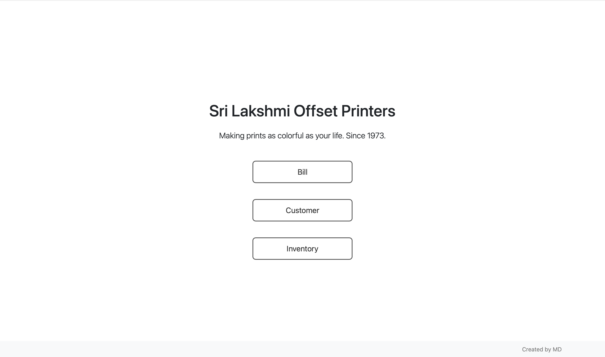
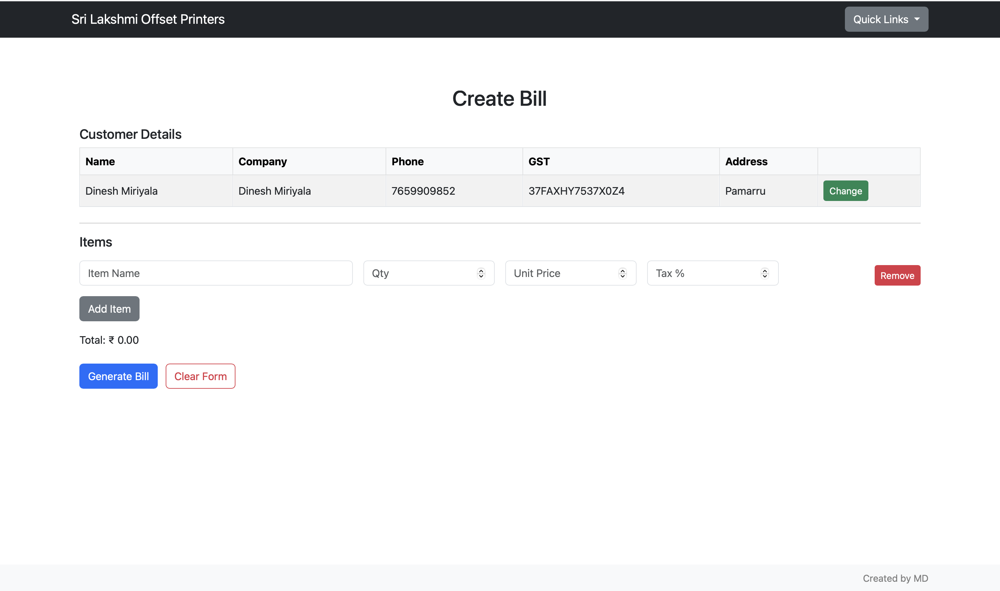
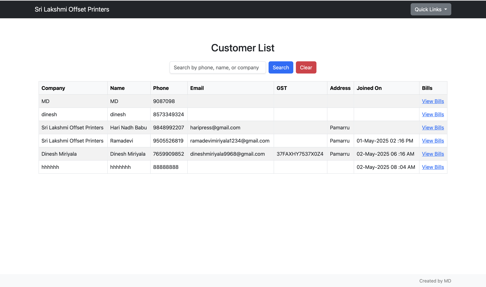
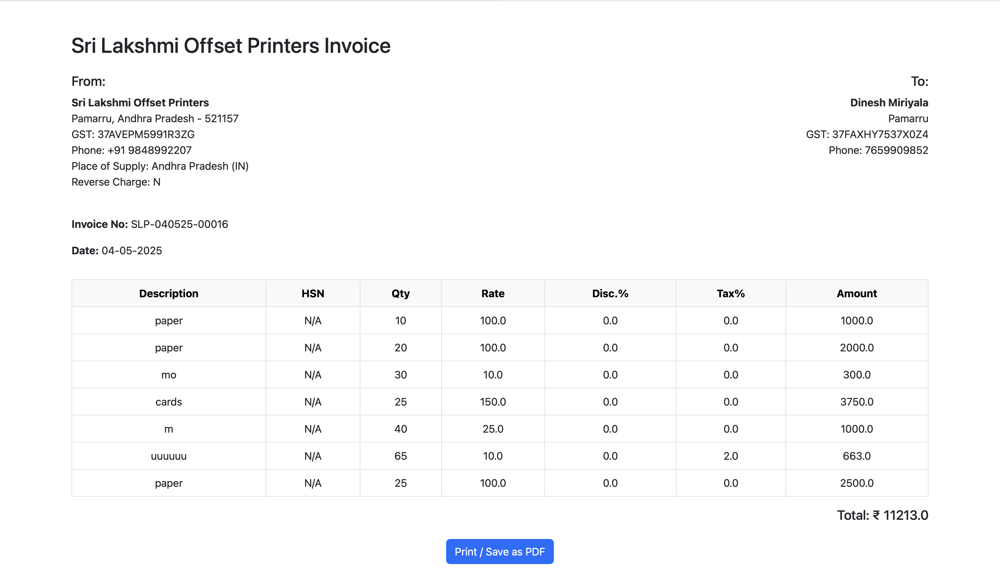

# 🧾 Bill Generator v1.0

## Overview

Bill Generator is a lightweight, local-first invoice generation tool designed to support small businesses with quick, professional, and customizable billing capabilities. Built using Flask, SQLAlchemy, and HTML/CSS, the application allows users to manage customers, inventory, and generate printable invoices with minimal friction.

---

## Features in Version 1.0

### Core Functionalities

- **Customer Management**
  - Add new customers with GST and contact details
  - View customers with search and filter capabilities
  - Duplicate phone number prevention with UI feedback

- **Inventory Management**
  - Add inventory items with name, HSN, price, quantity, and tax
  - View inventory with live filtering and item editing (future-ready)

- **Invoice Creation**
  - Guided 3-step invoice creation process:
    1. Select or create customer
    2. Enter item details
    3. Preview and generate invoice
  - Item dropdown with auto-fill for price and tax
  - New items can be typed and will be saved automatically
  - Automatic calculation of subtotal, tax, and total
  - Invoice IDs follow `SLP-DDMMYY-XXXXX` format

- **Invoice Management**
  - View invoices with filters for phone, date range, and text search
  - Each invoice opens in a printable HTML preview format
  - Print/download invoice directly from the browser

- **Data Handling**
  - All data stored in SQLite using SQLAlchemy ORM
  - Auto-increment IDs and foreign key relationships managed via ORM
  - Timezone-aware timestamps and readable date formatting

---

## Tech Stack

- **Backend:** Python, Flask, SQLAlchemy
- **Frontend:** HTML5, CSS3, Jinja2, JavaScript (Vanilla)
- **PDF (Preview):** HTML-based rendering with print support
- **Database:** SQLite (for development), structure ready for PostgreSQL
- **ORM Support:** Flask-Migrate for schema changes

---

## Folder Structure

```
├── app.py                  # Main Flask application
├── db/
│   ├── models.py           # SQLAlchemy ORM models
│   └── app.db              # SQLite database file
├── static/
│   ├── css/
│   │   └── style.css       # Custom styles
│   └── pdfs/               # Stored PDF invoices (if needed)
├── templates/
│   ├── base.html
│   ├── home.html
│   ├── add_customer.html
│   ├── add_inventory.html
│   ├── view_customers.html
│   ├── view_inventory.html
│   ├── select_customer.html
│   ├── create_bill.html
│   ├── view_bills.html
│   └── bill_preview.html
├── pdf.py                  # ReportLab PDF support (optional/fallback)
├── requirements.txt
└── README.md
```

---

## How to Run

### Prerequisites

- Python 3.8+
- pip
- Recommended: virtualenv or venv

### Installation

```bash
python -m venv env
source env/bin/activate  # On Windows: env\Scripts\activate
pip install -r requirements.txt
flask db init
flask db migrate
flask db upgrade
python app.py
```

Then go to `http://127.0.0.1:5000` in your browser.

---

## ✅ Version 2.0 – Latest Updates

### 🔧 Bug Fixes
- "Bill generated successfully" button now stays visible until manually dismissed
- Font sizes increased in the generated PDF for improved readability
- Fixed "Edit User" form to match the style and functionality of "Add Customer"
- Only admins can now access bill and customer edit/delete functions
- Font rendering in preview and PDF made consistent (more Mac-like appearance)

### ✨ New Features
- Total field in Create Bill is now editable
- Editing the Total auto-updates Unit Price
- Smart field tracking: whichever field (Qty / Rate / Total) was edited last is used to compute others
- Role-based access control with a login redirect for restricted actions
- Toggle to include/exclude phone number from final invoice PDF
- Admins have an Edit button for each customer in the UI
- Added support for deleting and recovering customers and invoices.
- Added support to edit customer after creation.
- Many quality of life upgrades.
- added a new about me page which can display info about customer. 

---

## 🛣 Roadmap: Version 3.0

- 🔐 User Authentication & Roles
  - Add login system with role-based access (admin, staff)
- 📤 Export & Sharing
  - Email or WhatsApp bills to customers directly
- 📊 Analytics & Reporting
  - Generate insights from invoices, customer history, inventory
- 📦 Inventory Enhancements
  - Add item categories, units, and stock tracking
- 📁 PDF Optimization
  - Better formatting, logo support, watermark, and PDF download without extra dependencies
- 🌐 Hosting Options
  - Deploy on local network with shared access
- 🧪 Testing & CI
  - Add test suite and basic CI/CD workflow for deployments

---

## 🖼 Screenshots

#### Homepage

#### Bill Creation

#### Customer Search

#### Sample Invoice


---

## 🚀 How to Use

### 🪟 For Windows Users

- Navigate to the `desktop-build` branch.
- Inside the `dist/` folder, you’ll find the `.exe` file (e.g., `BillGenerator.exe`).
- Just run the `.exe` — it includes all dependencies and launches the app in your default browser.
- No Python or installation required.

> ⚠️ Make sure your system allows running `.exe` files from unknown developers if Windows Defender warns you.

---

### 🍎 For Mac Users

- Clone the repository and set up a virtual environment:
  ```bash
  python3 -m venv env
  source env/bin/activate
  pip install -r requirements.txt
  python desktop_launcher.py
  ```
- This will launch the app in your default browser.

> Note: macOS doesn’t support `.exe` files. Use the Python launcher script instead.

---

## License

MIT License. Modify and use freely.

---

## Author

Developed and maintained by Dinesh Miriyala
